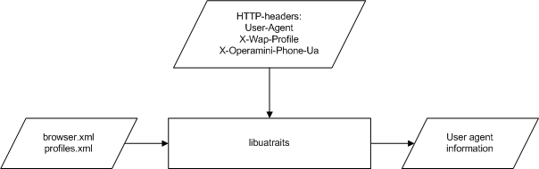

#Overview
All of the library interfaces take `User-Agent`, `X-Wap-Profile` and `X-Operamini-Phone-Ua` HTTP-headers as an input data. Library also uses data from `browser.xml` and `profiles.xml` files to represent the parameters of the user device and web-application as a set of fields.

An output data from the library may contain the following fields:
* `isMobile` - `true`, if the user device is mobile. For tablets `isTablet` field will be used additionally;
* `BrowserEngine` - Presto, Gecko, Trident, WebKit etc.;
* `BrowserEngineVersion` - version of engine of the browser if can be identified;
* `BrowserName` -  Mozilla Firefox, Opera, Safari etc.;
* `BrowserVersion` - version of the browser if can be identified;
* `isTouch` - `true`, if user device has a touch screen with a confidence. For example, all of the devices with Windows Phone 7 have a touch screen;
* `isTablet` - `true`, if the device is tablet. `isMobile=true` for all tablets;
* `OSFamily` - family of operating systems (Windows, Linux, MacOS, Android, iOS etc.). `Unknown` if can't be identified;
* `OSName` - user-friendly name of the operating system, for example, `Android Jelly Bean`;
* `OSVersion` - version of the operating system (Windows98, 2.3.4, 5.0);
* `isBrowser` - `true` if user application is browser (`true` by default);
* `BrowserShell` - Maxthon, iCab etc.;
* `BrowserShellVersion` - version of the browser shell;
* `isRobot` - `true` if application is a search robot;
* `x64` - `true`, if 64-bit operating system used with confidence;
* `YandexBar` - `true`, if Yandex Bar installed;
* `YandexBarVersion` -  version of Yandex Bar;
* `MailRuAgent` - `true`, if Mail.Ru Agent installed;
* `MailRuAgentVersion` -  version of Mail.ru Agent;
* `MailRuSputnik` - `true`, if Mail.Ru Sputnik installed;
* `GoogleToolBar` - `true`, if Google Toolbar installed;
* `GoogleToolBarVersion` - version of Google Toolbar;
* `isWAP` - `true`, if weak or wap browser installed at user device;
* `MultiTouch` - `true`, if push and pool gestures can be catched by browser using JavaScript;
* `preferMobile` - `false`, if mobile device with high resolution used;
* `isBeta` - `true`, if user application is a browser beta-version;
* `isEmulator` - `true`, if device emulator used, just for iOS emulators.
